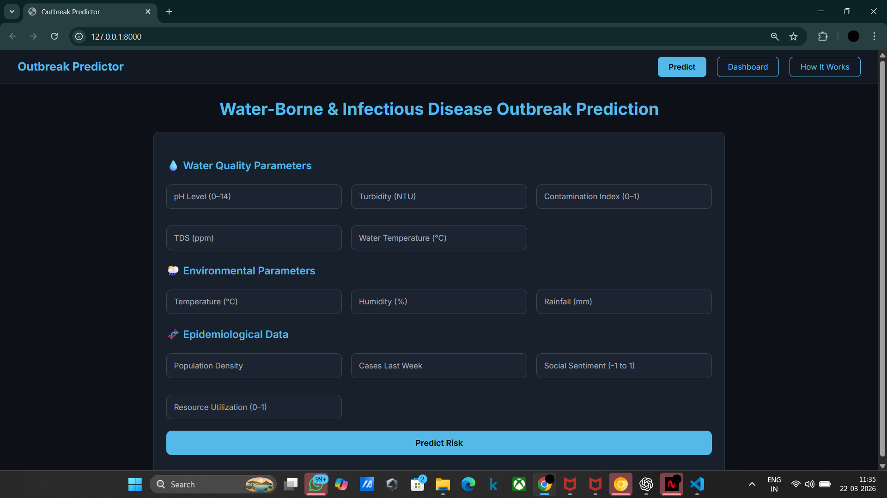
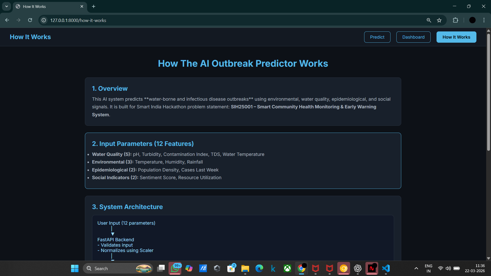

# 🦠 AI Outbreak Predictor

An AI-powered system to predict water-borne and infectious disease outbreaks using environmental, water quality, and epidemiological data.

---

## 🚀 Features

* Predict outbreak risk (Low / Medium / High)
* Real-time dashboard visualization
* Feature importance analysis
* Safety recommendations
* Weekly trend tracking

---

## 🧠 Tech Stack

* Frontend: HTML, CSS, JavaScript
* Backend: FastAPI (Python)
* Machine Learning: Logistic Regression (Scikit-learn)
* Visualization: Chart.js

---

## 📊 Input Parameters

* Water Quality: pH, Turbidity, TDS, Temperature
* Environmental: Rainfall, Humidity
* Epidemiological: Population, Cases
* Social: Sentiment Score, Resource Utilization

---

## ⚙️ Installation

```bash
git clone https://github.com/yourusername/outbreak-predictor-ai.git
cd backend
pip install -r requirements.txt
uvicorn main:app --reload
```

---

## 🌐 Usage

Open in browser:
http://127.0.0.1:8000

---

## 📸 Screenshots

<p align="center">
  
  
  
</p>
---

## 🎯 Future Improvements

* Deploy on cloud (Render / AWS)
* Add real-time data APIs
* Improve ML model accuracy

---

## 👨‍💻 Author

Adarsh

